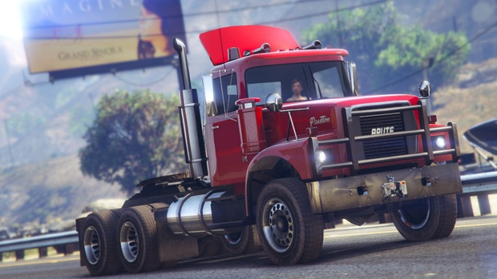

# Truck Simulator

### Что это?

**Truck Simulator** это игровая многопользовательская модификация на основе [Rage Multiplayer](https://rage.mp/) для GTA V. Разработка ведется силами команды энтузиастов и фанатов серии GTA.

### Концепция

Концепция нашей модификации необычна и в некоторых аспектах хардкорна. Мы не стремимся создать типовой RP сервер, а делаем упор на симуляторе автотранспорта и экономике игрового мира. В тоже время, некоторые RP элементы будут присутствовать. Внутриигровые порядки подчинены законодательным, исполнительным и судебным институтам, управляемым самими игрокам.

#### Главные аспекты концепции проекта:

* Мы не продаем игровое преимущество, сервера без донатов и pay-2-win модели.
* Симулятор автотранспорта \(управление, физика, системы и узлы, столкновения, износ, тюнинг, ремонт, покупка, продажа и т.д.\)
* Экономика игрового мира сильно завязана на логистике, грузоперевозках и функционировании коммерческих предприятий.
* Никаких реальных брендов, весь дополнительный контент в моде соответствует стилистике вселенной GTA. Мы строго подходим к выбору сторонних DLС, подбираем только качественные модификации, а что то создаем сами.
* Само-регулируемое сообщество. Экономика и муниципальные учреждения управляются игроками.
* Role Play приветствуется, но не обязателен.
* Карательная политика в отношении читеров и багоюзеров.

### Поддержка проекта

На данный момент проект разрабатывается на чистом энтузиазме. Но вы можете поддержать нас!

#### Единоразовая поддержка

* Bitcoin:
* Ethereum: 

#### Постоянная поддержка

* [Страница на Patreon](https://www.patreon.com/gtavmp)

#### Присоединение к нашей команде

Вы можете помочь проекту приняв участие в разработке или поддержки работы серверов. Нам нужны дизайнеры, менеджеры игрового контента, создатели DLC и модов для GTA V \(модели транспорта, интерьеры, звук, текстуры\), создатели видеороликов из GTA V, создатели внутриигровых кодексов и законов, создатели аудиотреков и т.д.

